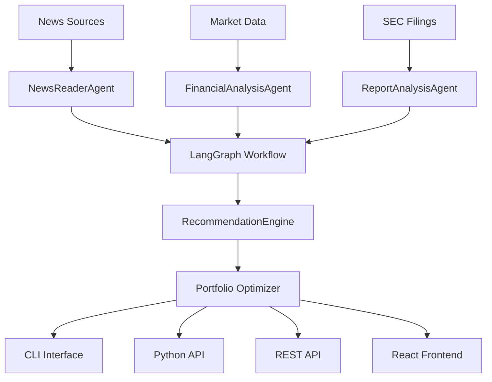

# TradeGraph Financial Advisor

<div align="center">
  
  
  
</div>

A sophisticated **multi-agent financial analysis system** that uses LangGraph, Firecrawl, and MCP (Model Context Protocol) to provide intelligent trading recommendations based on real-time financial news and comprehensive company analysis.

## 🚀 Key Features

### 🤖 **Multi-Agent Architecture**
- **NewsReaderAgent**: Scrapes and analyzes financial news from 50+ sources
- **FinancialAnalysisAgent**: Processes market data and technical indicators
- **ReportAnalysisAgent**: AI-powered SEC filing analysis (10-K, 10-Q)
- **TradingRecommendationEngine**: Generates sophisticated buy/sell/hold recommendations

### 📊 **Advanced Analytics**
- **Real-time market data** with 20+ technical indicators
- **AI-powered sentiment analysis** using GPT-4
- **Portfolio optimization** with risk assessment
- **Multi-factor scoring** system for recommendations

### 🌐 **Modern Interfaces**
- **Beautiful React frontend** with real-time charts
- **FastAPI backend** with WebSocket support
- **Command-line interface** for automation
- **Python API** for custom integrations

### 🛡️ **Production Ready**
- Comprehensive error handling and retry logic
- Rate limiting and security middleware
- Health monitoring and metrics
- Extensive testing suite

## 🎯 Quick Start

### Installation

```bash
# Install the package
pip install tradegraph-financial-advisor

# Or install from source
git clone https://github.com/tradegraph/financial-advisor.git
cd financial-advisor
pip install -e .
```

### Configuration

```bash
# Copy environment template
cp .env.example .env

# Add your API keys
OPENAI_API_KEY=your_openai_key
FIRECRAWL_API_KEY=your_firecrawl_key
```

### Basic Usage

=== "Command Line"

    ```bash
    # Basic analysis
    tradegraph AAPL MSFT GOOGL

    # Comprehensive analysis with custom parameters
    tradegraph AAPL MSFT --portfolio-size 250000 \
      --risk-tolerance aggressive \
      --analysis-type comprehensive
    ```

=== "Python API"

    ```python
    import asyncio
    from tradegraph_financial_advisor import FinancialAdvisor

    async def main():
        advisor = FinancialAdvisor()

        results = await advisor.analyze_portfolio(
            symbols=["AAPL", "MSFT", "GOOGL"],
            portfolio_size=100000,
            risk_tolerance="medium",
            include_reports=True
        )

        advisor.print_recommendations(results)

    asyncio.run(main())
    ```

=== "Web Interface"

    ```bash
    # Start the API server
    python -m api.main

    # Start the frontend (in another terminal)
    cd frontend
    npm install
    npm run dev

    # Open http://localhost:3000
    ```

## 📈 Example Output

```json
{
  "portfolio_recommendation": {
    "recommendations": [
      {
        "symbol": "AAPL",
        "recommendation": "BUY",
        "confidence_score": 0.87,
        "target_price": 225.00,
        "current_price": 195.89,
        "recommended_allocation": 0.12,
        "key_factors": [
          "Strong iPhone 15 sales momentum",
          "Services growth acceleration",
          "AI integration potential"
        ],
        "risks": ["Market competition", "Supply chain risks"],
        "analyst_notes": "Strong fundamentals with positive growth catalysts"
      }
    ],
    "total_confidence": 0.85,
    "overall_risk_level": "medium",
    "expected_return": 0.15
  }
}
```

## 🏗️ Architecture



## 🔧 Analysis Types

| Type | Duration | Features | Use Case |
|------|----------|----------|----------|
| **Quick** | ~30s | Basic market data + news sentiment | Rapid insights |
| **Standard** | ~2-3min | + Technical indicators + portfolio optimization | Regular analysis |
| **Comprehensive** | ~5-10min | + SEC filing analysis + deep fundamentals | In-depth research |

## 🎨 Frontend Features

- **🌓 Dark/Light Mode**: Automatic theme switching
- **📱 Responsive Design**: Works on all devices
- **📊 Interactive Charts**: Real-time data visualization
- **🔔 Real-time Alerts**: WebSocket-powered notifications
- **⚡ Fast Performance**: Optimized with React Query & Vite

## 🧪 Testing

```bash
# Run all tests
pytest

# Run with coverage
pytest --cov=tradegraph_financial_advisor

# Run specific test categories
pytest tests/unit/
pytest tests/integration/
```

## 📚 Documentation

- **[Getting Started](getting-started/installation.md)** - Installation and setup
- **[User Guide](user-guide/cli.md)** - Detailed usage instructions
- **[API Reference](api-reference/core.md)** - Complete API documentation
- **[Examples](examples/basic.md)** - Code examples and tutorials

## 🤝 Contributing

We welcome contributions! Please see our [Contributing Guide](development/contributing.md) for details.

## 📄 License

This project is licensed under the MIT License - see the [LICENSE](https://github.com/tradegraph/financial-advisor/blob/main/LICENSE) file for details.

## ⚠️ Disclaimer

!!! warning "Investment Disclaimer"
    This software is for educational and research purposes only. It does not constitute financial advice.
    Always conduct your own research and consult with qualified financial advisors before making investment decisions.
    Past performance does not guarantee future results.

## 🆘 Support

- **🐛 Bug Reports**: [GitHub Issues](https://github.com/tradegraph/financial-advisor/issues)
- **💬 Discussions**: [GitHub Discussions](https://github.com/tradegraph/financial-advisor/discussions)
- **📧 Email**: support@tradegraph.com

---

<div align="center">
  <strong>Built with ❤️ by the TradeGraph Team</strong>
</div>